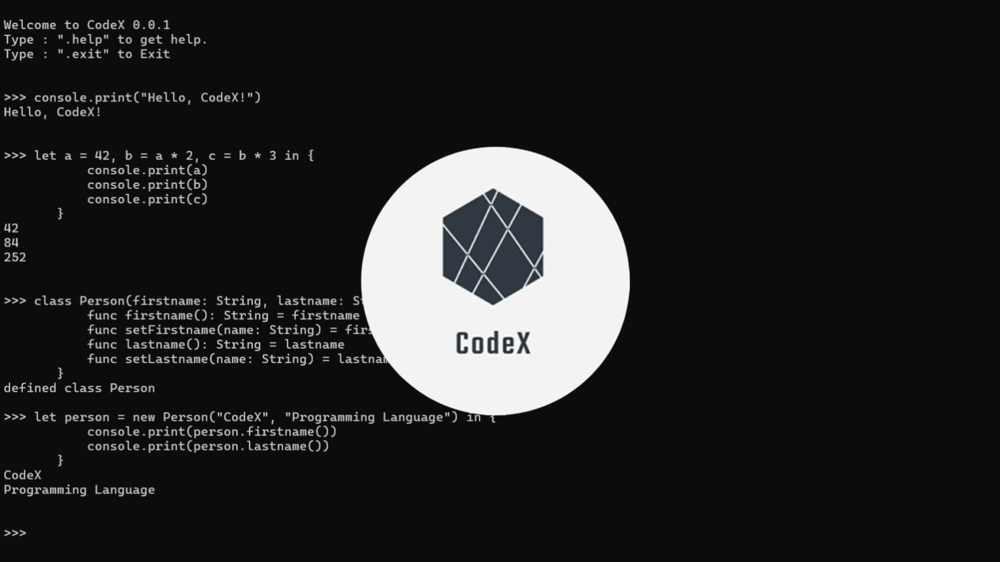

# CodeX - Interpreted, Object-Oriented Programming Language

**CodeX** is a small, interpreted, object-oriented, and statically-typed programming language that I developed to explore language design and implementation. It features custom syntax, an interpreter, and basic memory management, making it a great learning project for understanding how programming languages work under the hood.

## 🚀 Features

✅ **Interpreted Execution** – Code is executed line by line, making debugging easier.  
✅ **Object-Oriented** – Supports classes, objects, and inheritance.  
✅ **Statically Typed** – Ensures type safety at compile time, reducing runtime errors.  
✅ **Custom Syntax & Parser** – A unique syntax designed from scratch with a tokenizer and AST-based interpreter.  
✅ **Basic Memory Management** – Uses reference counting for garbage collection.

## 🛠 Technologies Used

- **Node.js** – For file handling and execution of the interpreter.
- **JavaScript** – Core implementation of tokenization, parsing, and execution.

## 📌 Example Code

```codex
class Person {
    let name: string;

    func init(name: string) {
        this.name = name;
    }

    func greet() {
        print("Hello, my name is " + this.name);
    }
}

let p = new Person("Advay");
p.greet();  // Output: Hello, my name is Advay
```

## 🔍 How It Works

1. **Lexical Analysis** – Converts raw source code into tokens.
2. **Parsing** – Constructs an Abstract Syntax Tree (AST) for structured execution.
3. **Type Checking** – Ensures variables and expressions follow static typing rules.
4. **Interpretation** – The AST is traversed, and code is executed dynamically.

---

## 📝 License

Distributed under the GPL-3.0 License. See [LICENSE](LICENSE) for more information.

---

## 🆘 Support

Having trouble? Want to request a feature? Here's how you can get help:

- Open an issue.
- Contact the maintainer: [Advay Sanketi](https://advay-sanketi-portfolio.vercel.app/)
